# Simple Flow 

## h2 console

## h2 console logged in

## h2 console simple query
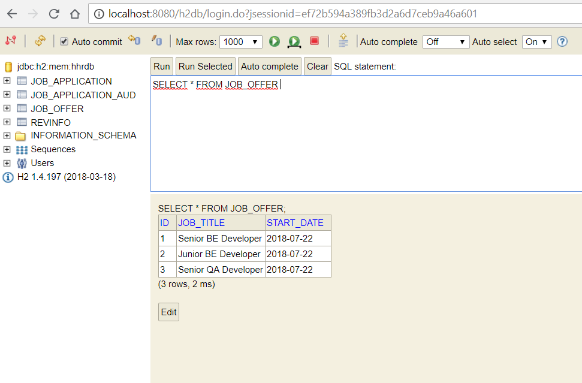

## Swagger UI
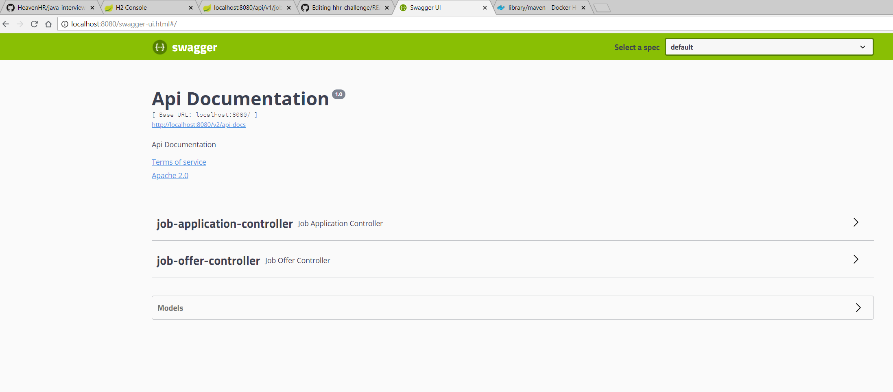

## Swagger UI Job Offer Endpoints
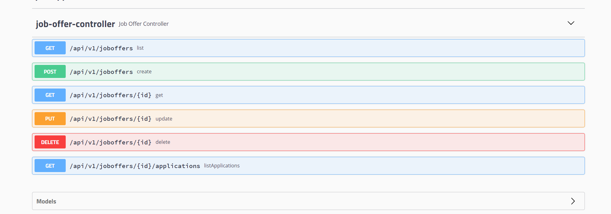

## Job Offer List
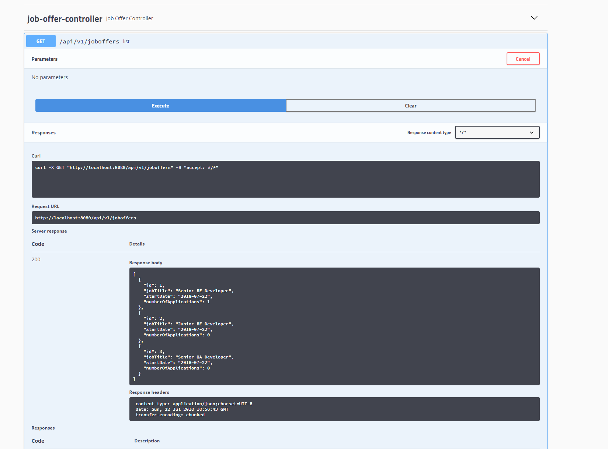

## Job Offer List JSON
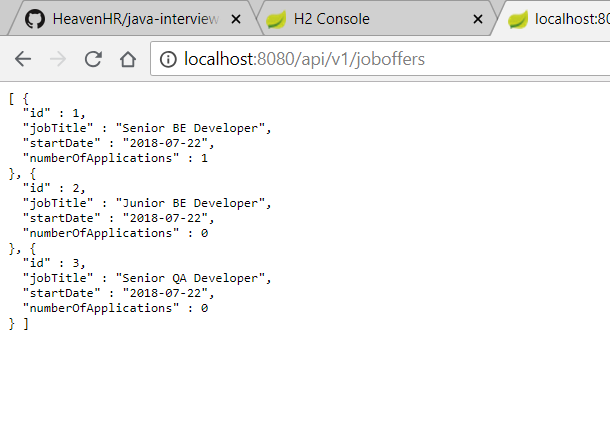

## Job Offer Get
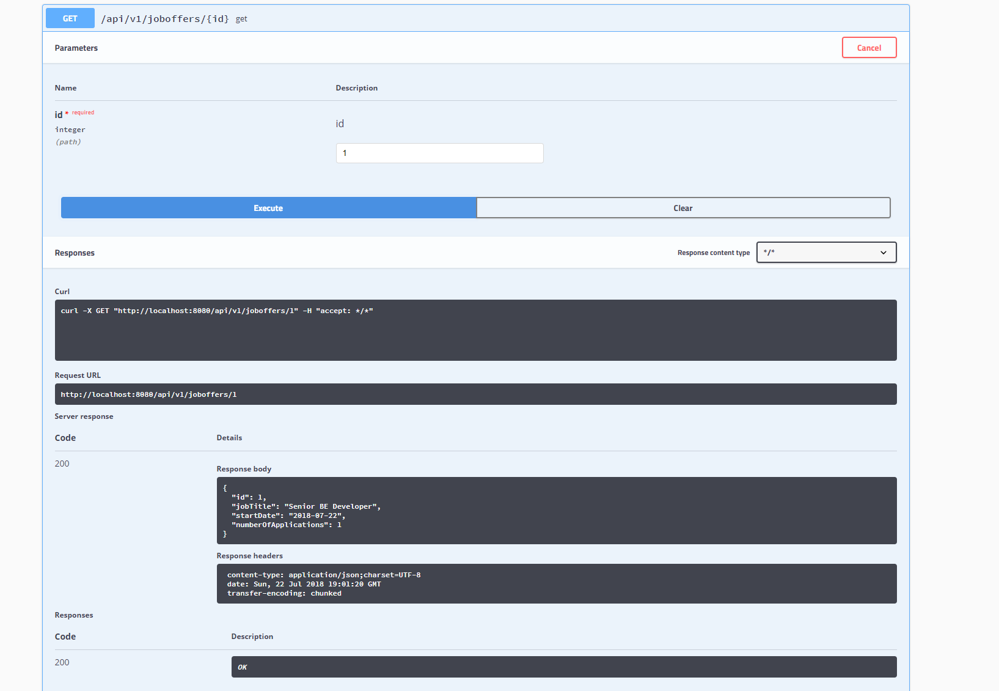

## Job Offer Delete
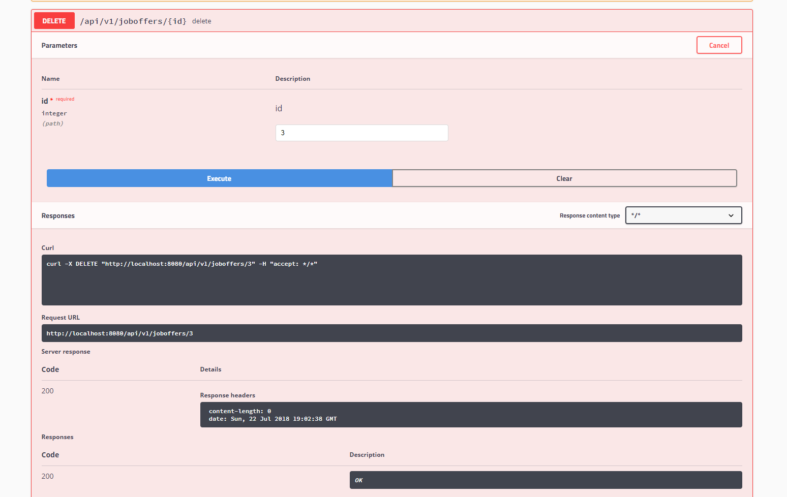

## Job Offer List after Delete

## Job Offer List Applications
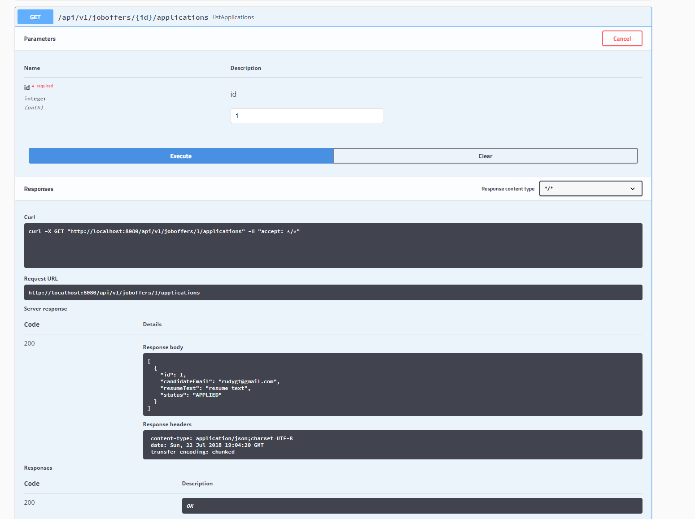

## Change Application Status
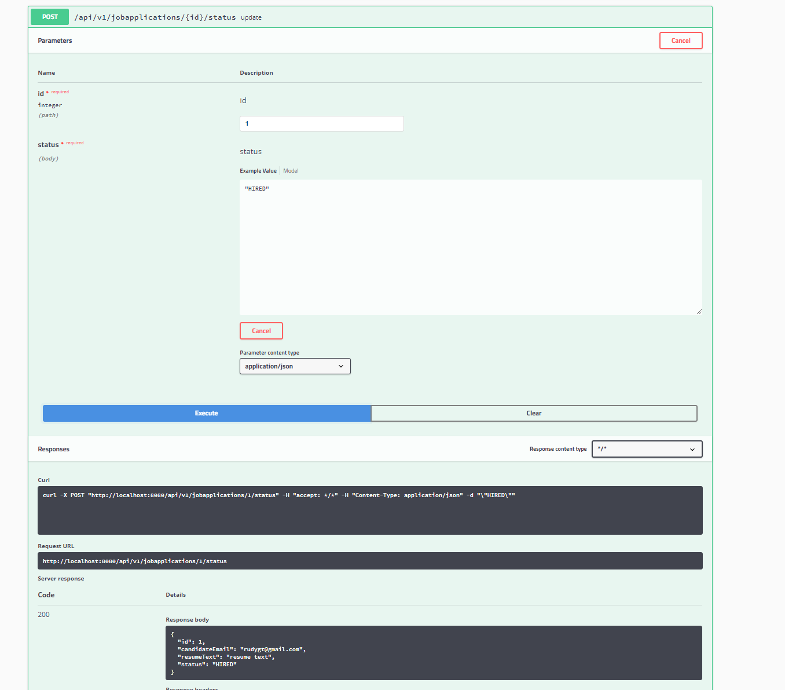

## Change Application Status Notification (log message)
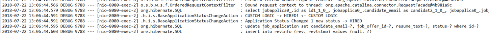

## Change Application Status Notification updated to APPLIED (log message)
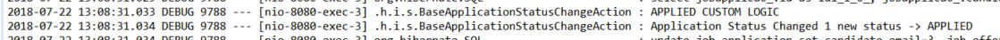

## Application Status Audit Log
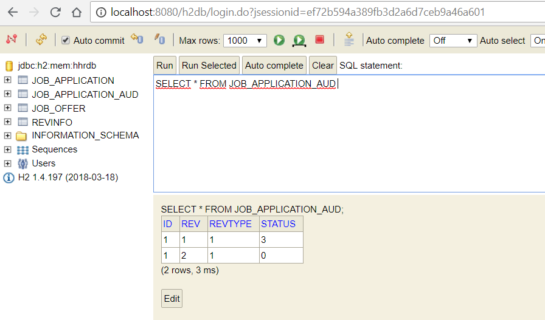
