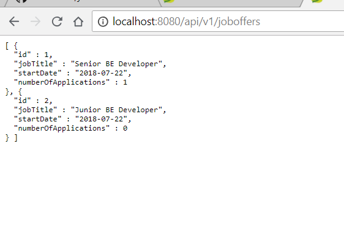

# Simple Flow 

## h2 console

## h2 console logged in

## h2 console simple query

## Swagger UI

## Swagger UI Job Offer Endpoints

## Job Offer List

## Job Offer List JSON

## Job Offer Get

## Job Offer Delete

## Job Offer List after Delete

## Job Offer List Applications

## Change Application Status

## Change Application Status Notification (log message)

## Change Application Status Notification updated to APPLIED (log message)

## Application Status Audit Log

